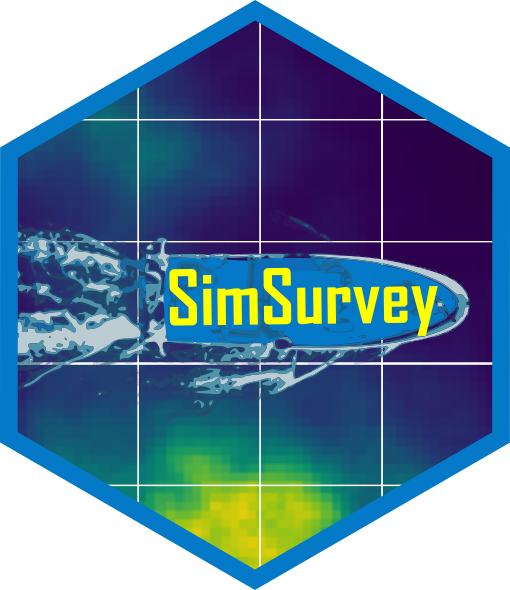

## SimSurvey 

<!-- badges: start -->

[](https://travis-ci.org/PaulRegular/SimSurvey)
[](https://www.repostatus.org/#active)
[](https://doi.org/10.1371/journal.pone.0232822)
[](https://CRAN.R-project.org/package=SimSurvey)

<!-- badges: end -->


The **`SimSurvey`** package has been designed to facilitate simulations of sample surveys of spatially-correlated age-structured populations. Sample surveys have become an integral part of the population monitoring programs led by many fisheries organizations and, as with any other monitoring program, good survey design and analysis is a critical prerequisite for obtaining reliable results. It has long been recognized that simulations are a useful tool for optimizing such surveys and, as such, several frameworks have been proposed and applied to try and answer the common question of "how much sampling is enough?". The **`SimSurvey`** package builds upon previous frameworks by increasing the complexity of the simulated population to reflect the dynamic structure seen in fish populations and extends the accessibility of the underlying simulation by wrapping it in an open-source `R` package.

## Installation

Install from CRAN:

```
install.packages("SimSurvey")
```

Or install the development version from GitHub:

```
install.packages("remotes")
remotes::install_github("PaulRegular/SimSurvey")
```

## Documentation

`pkgdown` site: https://paulregular.github.io/SimSurvey/  
PLOS ONE journal article: https://doi.org/10.1371/journal.pone.0232822  

